# Skin Cancer Detection

Author: Cayke Felipe dos Anjos

# Summary

In this project we analyze data from the ISIC 2024 - Skin Cancer Detection with 3D-TBP competition from Kaggle (https://www.kaggle.com/competitions/isic-2024-challenge/overview). Skin cancer is one of the most common cancers and if it is left without proper diagnosis and treatment, it can evolve fast to an irreversible condition. 

For this problem, we are given a dataset with analytical data containing patients medical data such as age and gender and also data about a skin lesion like location, radius, perimeter and color alongside with another dataset containing pictures of the lesion in order to determine if such skin lesion is benign (target=0) or malignant (target=0).

The dataset is extremely unbalanced, containing over 400 thousand data points but less than 400 malignant lesions. Because of this, we focus the metrics of our model to a partial Area Under the Curve for Receiver Operating Characteristic curve for True Positive Rate (tpr) above 0.8. A perfect score for this case would be 0.2.

We first conduct an exploratory data analysis and clean the data off features that do not help our models. We use imputation methods with the median for missing data and split it into a training set and a test set. We first analyze the analytical data with different models and methods and proceed to employ a custom Convolutional Neural Network developed by British Scientists for malignant skin lesion detection called SkinLesNet. Based on these different methodologies, we make a model recommendation to use in the future to predict if a lesion is malignant or not.

The best model is the Stochastic Gradient Descent, with an pAUC-ROC of 0.098. We propose future steps and conclude our work.

# Business Problem

Skin cancer can be deadly if not caught early, but many populations lack specialized dermatologic care. Over the past several years, dermoscopy-based AI algorithms have been shown to benefit clinicians in diagnosing melanoma, basal cell, and squamous cell carcinoma. However, determining which individuals should see a clinician in the first place has great potential impact. Triaging applications have a significant potential to benefit underserved populations and improve early skin cancer detection, the key factor in long-term patient outcomes.

Dermatoscope images reveal morphologic features not visible to the naked eye, but these images are typically only captured in dermatology clinics. Algorithms that benefit people in primary care or non-clinical settings must be adept to evaluating lower quality images. This project leverages 3D TBP (Total Body Photo) to present a novel dataset of every single lesion from thousands of patients across three continents with images resembling cell phone photos.

Our company wants to develop a tool that analyzes pictures and patient/skin lesion data obtained in clinics in hope that an AI tool can be developed to analyze pictures from the lesion taken from smartphones can be used to determine if, at least, the patient needs to be a doctor. Along with that, when examined we want to develop an algorithm that can help doctors conclude if a biopsy is necessary or not based on the patient and lesion data. A final model containing both data can also be used if it scores better than individual ones.

Questions we want to answer:
- can we use low quality pictures of the a lesion to determine if it is malignant or not?
- does data from the lesion measured in the office give us a better insight than the pcitures themselves?
- do the models perform well enough to be employed? What is the rate of false negatives and false positives for each model?

    2024-08-02 08:49:24.886458: W tensorflow/stream_executor/platform/default/dso_loader.cc:59] Could not load dynamic library 'libcudart.so.10.1'; dlerror: libcudart.so.10.1: cannot open shared object file: No such file or directory
    2024-08-02 08:49:24.886783: I tensorflow/stream_executor/cuda/cudart_stub.cc:29] Ignore above cudart dlerror if you do not have a GPU set up on your machine.

# Analytical data analysis

We first start reading the analytical data and getting information from each feature

    <class 'pandas.core.frame.DataFrame'>
    RangeIndex: 401059 entries, 0 to 401058
    Data columns (total 55 columns):
     #   Column                        Non-Null Count   Dtype  
    ---  ------                        --------------   -----  
     0   isic_id                       401059 non-null  object 
     1   target                        401059 non-null  int64  
     2   patient_id                    401059 non-null  object 
     3   age_approx                    398261 non-null  float64
     4   sex                           389542 non-null  object 
     5   anatom_site_general           395303 non-null  object 
     6   clin_size_long_diam_mm        401059 non-null  float64
     7   image_type                    401059 non-null  object 
     8   tbp_tile_type                 401059 non-null  object 
     9   tbp_lv_A                      401059 non-null  float64
     10  tbp_lv_Aext                   401059 non-null  float64
     11  tbp_lv_B                      401059 non-null  float64
     12  tbp_lv_Bext                   401059 non-null  float64
     13  tbp_lv_C                      401059 non-null  float64
     14  tbp_lv_Cext                   401059 non-null  float64
     15  tbp_lv_H                      401059 non-null  float64
     16  tbp_lv_Hext                   401059 non-null  float64
     17  tbp_lv_L                      401059 non-null  float64
     18  tbp_lv_Lext                   401059 non-null  float64
     19  tbp_lv_areaMM2                401059 non-null  float64
     20  tbp_lv_area_perim_ratio       401059 non-null  float64
     21  tbp_lv_color_std_mean         401059 non-null  float64
     22  tbp_lv_deltaA                 401059 non-null  float64
     23  tbp_lv_deltaB                 401059 non-null  float64
     24  tbp_lv_deltaL                 401059 non-null  float64
     25  tbp_lv_deltaLB                401059 non-null  float64
     26  tbp_lv_deltaLBnorm            401059 non-null  float64
     27  tbp_lv_eccentricity           401059 non-null  float64
     28  tbp_lv_location               401059 non-null  object 
     29  tbp_lv_location_simple        401059 non-null  object 
     30  tbp_lv_minorAxisMM            401059 non-null  float64
     31  tbp_lv_nevi_confidence        401059 non-null  float64
     32  tbp_lv_norm_border            401059 non-null  float64
     33  tbp_lv_norm_color             401059 non-null  float64
     34  tbp_lv_perimeterMM            401059 non-null  float64
     35  tbp_lv_radial_color_std_max   401059 non-null  float64
     36  tbp_lv_stdL                   401059 non-null  float64
     37  tbp_lv_stdLExt                401059 non-null  float64
     38  tbp_lv_symm_2axis             401059 non-null  float64
     39  tbp_lv_symm_2axis_angle       401059 non-null  int64  
     40  tbp_lv_x                      401059 non-null  float64
     41  tbp_lv_y                      401059 non-null  float64
     42  tbp_lv_z                      401059 non-null  float64
     43  attribution                   401059 non-null  object 
     44  copyright_license             401059 non-null  object 
     45  lesion_id                     22058 non-null   object 
     46  iddx_full                     401059 non-null  object 
     47  iddx_1                        401059 non-null  object 
     48  iddx_2                        1068 non-null    object 
     49  iddx_3                        1065 non-null    object 
     50  iddx_4                        551 non-null     object 
     51  iddx_5                        1 non-null       object 
     52  mel_mitotic_index             53 non-null      object 
     53  mel_thick_mm                  63 non-null      float64
     54  tbp_lv_dnn_lesion_confidence  401059 non-null  float64
    dtypes: float64(35), int64(2), object(18)
    memory usage: 168.3+ MB

    target
    0    400666
    1       393
    Name: count, dtype: int64

    image_type
    TBP tile: close-up    401059
    Name: count, dtype: int64

    tbp_tile_type
    3D: XP       285903
    3D: white    115156
    Name: count, dtype: int64

    target
    0    285706
    1       197
    Name: count, dtype: int64

    target
    0    114960
    1       196
    Name: count, dtype: int64

The dataset is extremely unbalanced and contain several columns with no important information to our models or analyzes.

We start by dropping columns that do not contain information that will add information to our model or that are only present in the training data.

Then we analyze how different features distribute the target class.

    (anatom_site_general
     posterior torso    121799
     lower extremity    102955
     anterior torso      87688
     upper extremity     70500
     head/neck           11968
     Name: count, dtype: int64)

     (anatom_site_general
     posterior torso    103
     anterior torso      82
     head/neck           78
     lower extremity     73
     upper extremity     57
     Name: count, dtype: int64)

    (tbp_lv_location
     Torso Back Top Third       71045
     Torso Front Top Half       63281
     Torso Back Middle Third    46153
     Left Leg - Lower           27404
     Right Leg - Lower          25184
     Torso Front Bottom Half    24347
     Left Leg - Upper           23659
     Right Leg - Upper          23030
     Right Arm - Upper          22954
     Left Arm - Upper           22796
     Head & Neck                11968
     Left Arm - Lower           11927
     Right Arm - Lower          10631
     Unknown                     5756
     Torso Back Bottom Third     4592
     Left Leg                    1968
     Right Leg                   1710
     Left Arm                    1591
     Right Arm                    601
     Torso Front                   60
     Torso Back                     9
     Name: count, dtype: int64)

     (tbp_lv_location
     Head & Neck                78
     Torso Front Top Half       69
     Torso Back Top Third       67
     Torso Back Middle Third    32
     Right Leg - Lower          24
     Left Leg - Lower           24
     Left Arm - Upper           20
     Right Arm - Upper          18
     Left Leg - Upper           14
     Torso Front Bottom Half    13
     Left Arm - Lower           12
     Left Leg                    6
     Right Arm - Lower           5
     Torso Back Bottom Third     4
     Right Leg - Upper           4
     Left Arm                    2
     Right Leg                   1
     Name: count, dtype: int64)

    (tbp_lv_location_simple
     Torso Back     121799
     Torso Front     87688
     Left Leg        53031
     Right Leg       49924
     Left Arm        36314
     Right Arm       34186
     Head & Neck     11968
     Unknown          5756
     Name: count, dtype: int64,
     tbp_lv_location_simple
     Torso Back     103
     Torso Front     82
     Head & Neck     78
     Left Leg        44
     Left Arm        34
     Right Leg       29
     Right Arm       23
     Name: count, dtype: int64)

Some of these columns have the same information, only more detailed. We do not need to distinguish between a lesion being on the right or left leg so we also drop the two lost columns.

    target
    0    5756
    Name: count, dtype: int64

    target
    0    2795
    1       3
    Name: count, dtype: int64

    target
    0    11507
    1       10
    Name: count, dtype: int64

Age and sex will need imputing since we cannot just delete data with target=1. Anatomic site general on the other hand, only has missing values on target=0 so we can drop those entries.

We use OneHotEncoder to create nominal features based on the location of the lesion.

Because of the size of our dataset, we need to sample part of it to run our models fast.

We split the dataset into three: X, y and a vector containing important id information for each point.

We divide X and y sets into train and test.

After dividing each set we can use imputation without data leakage.

Finally, we check the correlation map to see feature importance.

    
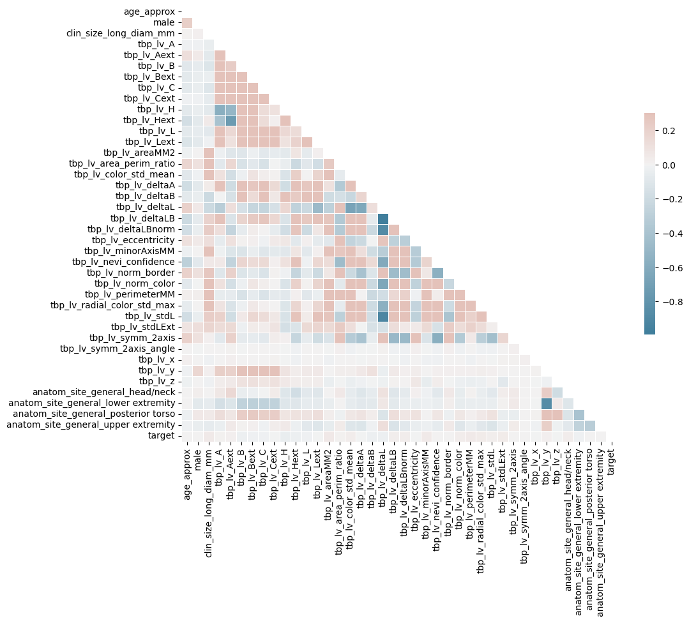
    

Features do not seem to be very important for our method

Next we use different models to see how they score with our data.

# Baseline model - Dummy Classifier

Our baseline model is a dummy classifier. This is important as this classifier will define our ROC curve with AUC=0.5

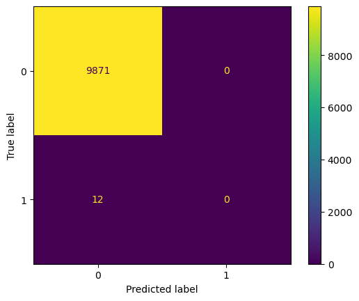
    

    
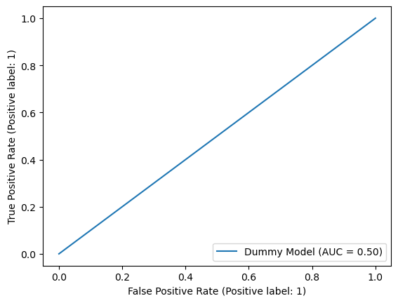
    

    pAUC ROC = 0.01999999999999999

# First model - Logistic Regression

Our first model is a simple logistic regression with no penalty. Before adding to our models we should start with a basic version of it to make sure that regularization is helping.

    
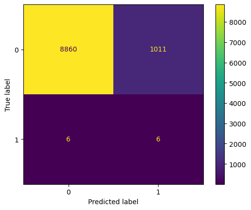
    

    Accuracy = 0.8970960234746534 Recall = 0.5 Precision = 0.0058997050147492625 F1 Score = 0.011661807580174927

    
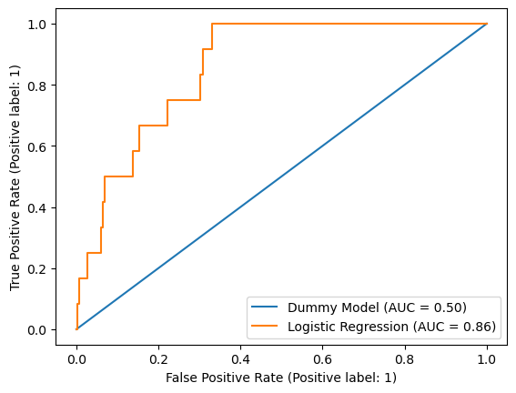
    

    pAUC ROC = 0.035903150643298534

# Second Model - Decision Trees

Our second model is a decision tree. We have also tried using Random Forests but our models failed to find any True Positives and had a large amount of False Positives.

    

    

    Accuracy = 0.9981786906809673 Recall = 0.0 Precision = 0.0 F1 Score = 0.0

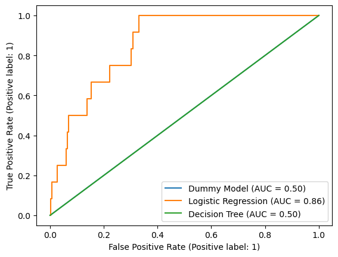
    

    pAUC ROC = 0.019987843176983072

# Third Model - Stochastic Gradient Classifier

Because of the size of our data, a smart approach would be using a stochastic gradient descent as it is much faster to calculate gradients and reach a good answer (which might not be optimal).

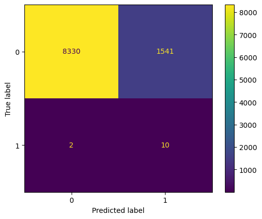
    

    Accuracy = 0.8438733178184762 Recall = 0.8333333333333334 Precision = 0.006447453255963894 F1 Score = 0.012795905310300703

    
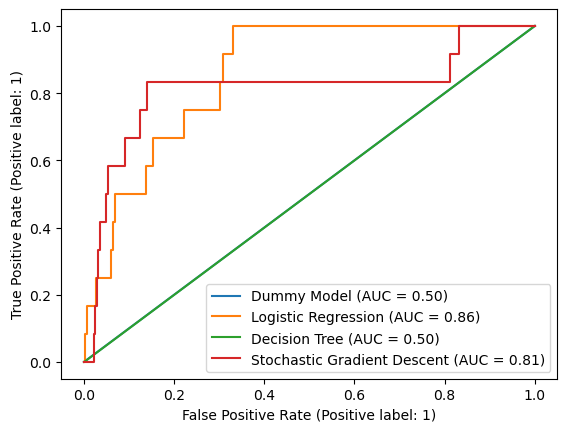
    

    pAUC ROC = 0.09855745787323132

We now start using regularization methods along with polynomial features to check if they make our answer better.

# Fourth Model -  Logistic Regression with L2 Penalty

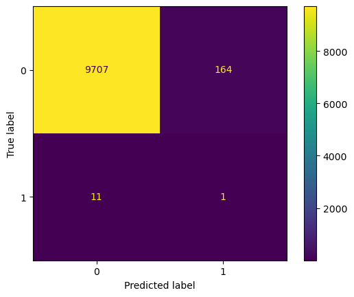
    

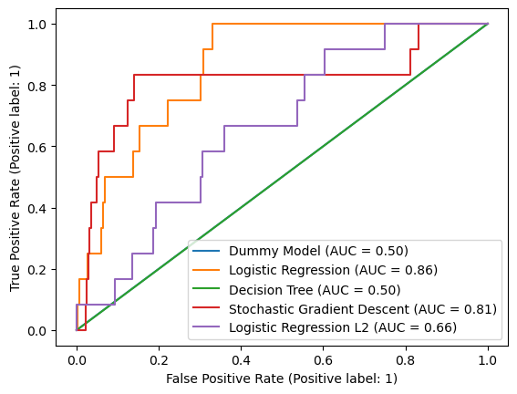
    

    pAUC ROC = 0.021455687459131883

# Fifth Model - Logistic Regression with L1 Penalty

    

    

    Accuracy = 0.9940301527876151 Recall = 0.08333333333333333 Precision = 0.02040816326530612 F1 Score = 0.032786885245901634

    
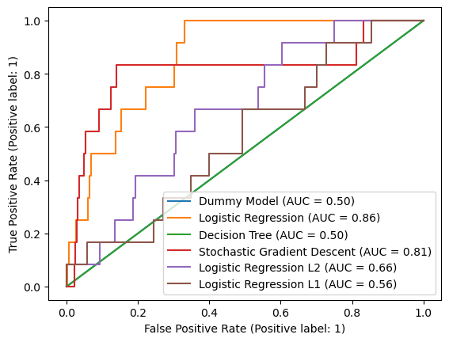
    

    pAUC ROC = 0.021712085908215977

# Summary of results for analytic data

| Model | pAUC | 
| --- | --- |
| Dummy | 0.02 |
| Logistic regression | 0.035 |
| Decision Trees | 0.019 |
| Stochastic Gradient Descent | 0.098 |
| Logistic Regression L2 | 0.021 |
| Logistic Regression L1 | 0.022  |

The only models that performed significantly better than the Dummy Classifier were simple Logistic Regression and Stochastic Gradient Descent.

# Image analysis

Our first approach to this set is to first check the kind of pictures we are dealing with.

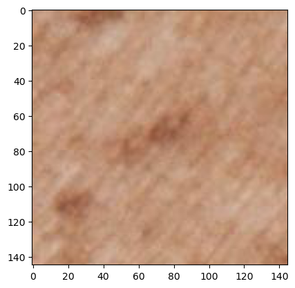
    

The images are in fact very low quality. We assemble the training and testing data. We use the indices to make sure those sets are the same than the ones we used before.

Finally we use ImageDataGenerator to convert each image to a format our Neural Network can accept. We also filter the images to grayscale so that our model can run faster and give us a first metric of its performance.

    Found 29647 validated image filenames.
    Found 9883 validated image filenames.

# SkinLesNet

SkinLesNet is a Convolutional Neural Network developed by a research group in the UK that has perfomred much better than previous models. The paper can be found in this link https://www.ncbi.nlm.nih.gov/pmc/articles/PMC10778045/pdf/cancers-16-00108.pdf .

We start by rebuilding the architecture of that neural network using tensorflow with our last node returning a probability of each instance being benign (target=0) or malign (target=1).

    Model: "sequential"
    _________________________________________________________________
    Layer (type)                 Output Shape              Param #   
    =================================================================
    conv2d (Conv2D)              (None, 143, 143, 32)      320       
    _________________________________________________________________
    max_pooling2d (MaxPooling2D) (None, 71, 71, 32)        0         
    _________________________________________________________________
    conv2d_1 (Conv2D)            (None, 69, 69, 64)        18496     
    _________________________________________________________________
    max_pooling2d_1 (MaxPooling2 (None, 34, 34, 64)        0         
    _________________________________________________________________
    conv2d_2 (Conv2D)            (None, 32, 32, 64)        36928     
    _________________________________________________________________
    max_pooling2d_2 (MaxPooling2 (None, 16, 16, 64)        0         
    _________________________________________________________________
    conv2d_3 (Conv2D)            (None, 14, 14, 128)       73856     
    _________________________________________________________________
    max_pooling2d_3 (MaxPooling2 (None, 7, 7, 128)         0         
    _________________________________________________________________
    dropout (Dropout)            (None, 7, 7, 128)         0         
    _________________________________________________________________
    flatten (Flatten)            (None, 6272)              0         
    _________________________________________________________________
    dense (Dense)                (None, 64)                401472    
    _________________________________________________________________
    dropout_1 (Dropout)          (None, 64)                0         
    _________________________________________________________________
    dense_1 (Dense)              (None, 1)                 65        
    =================================================================
    Total params: 531,137
    Trainable params: 531,137
    Non-trainable params: 0
    _________________________________________________________________

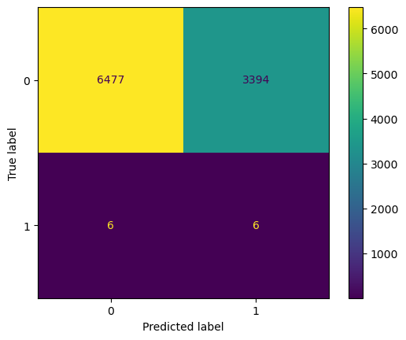
    

    Accuracy = 0.6559749064049377 Recall = 0.5 Precision = 0.0017647058823529412 F1 Score = 0.003516998827667058

    pAUC ROC = 0.026246580893526477

| Model | pAUC | 
| --- | --- |
| CNN | 0.026 |

The CNN did not perform very well for our data. However, we used grayscaled pictures, with a different end node, with less epoches and with an extremely unbalanced dataset. We should run this again later with more data and time to see its real performance.

# Results

Our best models were (in descendent order of importance):
| Model | pAUC | 
| --- | --- |
| Stochastic Gradient Descent | 0.098|
| Logistic Regression | 0.035|
| CNN | 0.026 |

This means that clinical patient data and measurements of lesion are still the best predictor if the lesion can be benign or not.

# Next steps

Four our next steps we have several recommendations:
- Add regularization to current CNN or use the original SkinLesNet model to test its true potential. Play with prediction thresholds;
- We only used one CNN architecture but others have been reported and we can fit them and see if our metrics become better. Employ Voting Classifier  and Pipelines.
- Try using GPU, clusters or a new computer to process data. This would require an investment to our current business.
